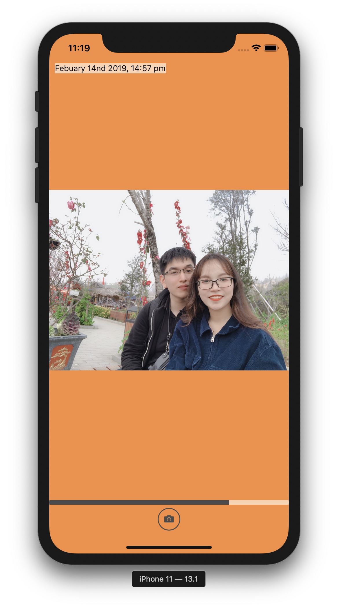

# projectMoments_RN

## My first ever completed personal programming project.

Checkout at branch `develop/feature` to see the project before it got redesigned.
 
Checkout at branch `master` for the new redesigned UI (the 2nd time).
 
I got to play around with a lot of React Native common and uncommon concepts:

-   React Native components
-   Styling and layout
-   Making a progress bar
-   Redux
-   Animation with Lottie
-   Swipe carousel
-   Moment.js

## Lesson learned:

Always do prototyping before coding, I wasted a dozen hours just because I constantly change the UI design.

## The idea is to have an application to save the memorable moments, and the carousel list is the timeline (and yes this is a gift to my gf).

There are two simple functions:

-   [x] Quick camera snap
-   [x] Horizontal carousel of picture and ordered by dates
         
        Screenshots:
         
        Welcome Screen
        
        Old UI
        
        New UI
        
        
